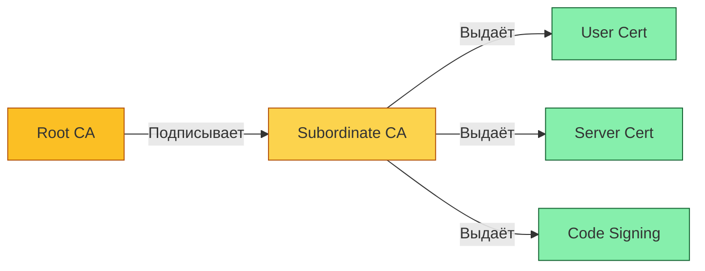

# Основы инфраструктуры открытых ключей

## Определение и назначение

**Инфраструктура открытых ключей (ИОК, англ. Public Key Infrastructure, PKI)** представляет собой совокупность аппаратных, программных, организационных мер и политик, обеспечивающих создание, управление, распространение, использование, хранение и отзыв цифровых сертификатов на базе асимметричной криптографии.

Основное назначение ИОК — обеспечение доверенного обмена информацией в незащищённых сетях путём подтверждения подлинности участников, обеспечения конфиденциальности и целостности данных, а также реализации механизма невозможности отказа от авторства.

> [!summary] Простыми словами
> Представьте, что ИОК — это паспортный стол для цифрового мира. Он выдаёт "цифровые паспорта" (сертификаты), проверяет их подлинность и ведёт список аннулированных документов. Благодаря этому компьютеры могут доверять друг другу без предварительной договорённости.

## Компоненты инфраструктуры открытых ключей

|Компонент|Назначение|Пример в лабораторной работе|
|---|---|---|
|Корневой центр сертификации (Root CA)|Доверенная сторона, выпускающая и подписывающая сертификаты своим закрытым ключом|SERVER-CA|
|Регистрационный центр (Registration Authority)|Проверка идентичности заявителя перед выдачей сертификата|user-AdminCA|
|Хранилище сертификатов (Certificate Database)|База данных выданных и отозванных сертификатов|%SystemRoot%\System32\CertLog|
|Точка публикации списков отзыва (CRL Distribution Point)|URL-адрес для загрузки актуальных списков отозванных сертификатов|http://SERVER-CA/CertEnroll/|
|Точка доступа к информации об издателе (AIA)|Ссылка на сертификат вышестоящего центра сертификации|Расширение сертификата|

## Принципы построения доверия

Доверие в инфраструктуре открытых ключей строится на иерархической модели, где каждый сертификат подписывается закрытым ключом вышестоящего центра сертификации. Корневой центр сертификации является самоподписанным и доверяется по умолчанию.

Цепочка доверия формируется путём последовательной проверки подписей от конечного сертификата до корневого. Клиентская система проверяет:

- Валидность периода действия каждого сертификата в цепочке.
- Отсутствие сертификата в актуальном списке отзыва.
- Соответствие расширений сертификата предполагаемому использованию.
- Корректность цифровой подписи каждого сертификата.

> [!attention] Важно помнить Если хотя бы одно звено цепочки доверия скомпрометировано (например, закрытый ключ ЦС украден), вся иерархия становится ненадёжной. Поэтому защита корневого центра сертификации — приоритетная задача.
