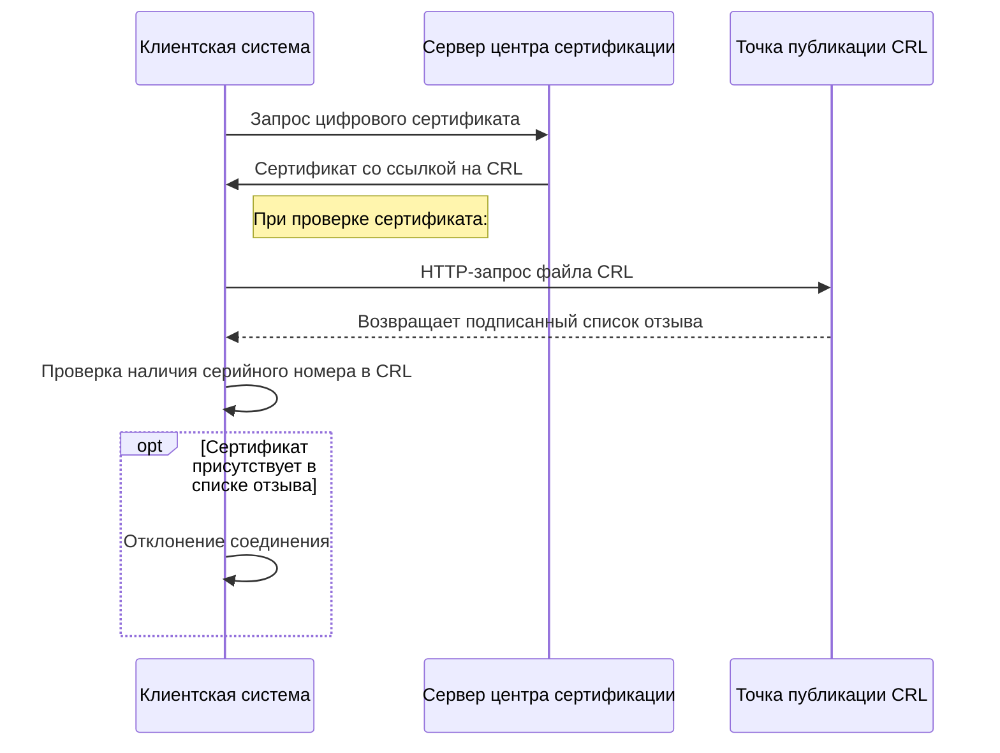

# Стандарт X.509 и механизмы отзыва сертификатов

## Структура сертификата X.509 версии 3

Сертификаты стандарта X.509 описываются с использованием нотации **ASN.1** (Abstract Syntax Notation One) и кодируются по правилам **DER** (Distinguished Encoding Rules).

### Формальное определение в нотации ASN.1

```text
Certificate ::= SEQUENCE {
     tbsCertificate       TBSCertificate,
     signatureAlgorithm   AlgorithmIdentifier,
     signatureValue       BIT STRING
}

TBSCertificate ::= SEQUENCE {
     version         [0] EXPLICIT Version DEFAULT v1,
     serialNumber         CertificateSerialNumber,
     signature            AlgorithmIdentifier,
     issuer               Name,
     validity             Validity,
     subject              Name,
     subjectPublicKeyInfo SubjectPublicKeyInfo,
     issuerUniqueID  [1] IMPLICIT UniqueIdentifier OPTIONAL,
     subjectUniqueID [2] IMPLICIT UniqueIdentifier OPTIONAL,
     extensions      [3] EXPLICIT Extensions OPTIONAL
}

Version ::= INTEGER { v1(0), v2(1), v3(2) }
CertificateSerialNumber ::= INTEGER
Validity ::= SEQUENCE {
     notBefore      Time,
     notAfter       Time
}
Time ::= CHOICE {
     utcTime        UTCTime,
     generalTime    GeneralizedTime
}
SubjectPublicKeyInfo ::= SEQUENCE {
     algorithm            AlgorithmIdentifier,
     subjectPublicKey     BIT STRING
}
AlgorithmIdentifier ::= SEQUENCE {
     algorithm               OBJECT IDENTIFIER,
     parameters              ANY DEFINED BY algorithm OPTIONAL
}
Extensions ::= SEQUENCE SIZE (1..MAX) OF Extension
Extension ::= SEQUENCE {
     extnID      OBJECT IDENTIFIER,
     critical    BOOLEAN DEFAULT FALSE,
     extnValue   OCTET STRING
}
```

> [!summary] Простыми словами ASN.1 — это строгий "язык описания данных", который гарантирует, что любой компьютер в мире поймёт структуру сертификата одинаково. DER — способ упаковки этих данных в бинарный файл. Благодаря этому сертификат, созданный в Windows, без ошибок прочитается в Linux, macOS или на сетевом оборудовании.

### Описание основных полей сертификата

|Поле|Тип данных|Практическое значение|
|---|---|---|
|version|INTEGER|Версия формата. Для X.509 v3 значение равно 2. Определяет поддержку блока расширений|
|serialNumber|INTEGER|Уникальный порядковый номер сертификата в пределах одного издателя. Используется для отслеживания в базе данных и списках отзыва|
|signature|AlgorithmIdentifier|Алгоритм подписи, применяемый центром сертификации. В лабораторной работе: sha256RSA|
|issuer|Name|Отличительное имя организации-издателя сертификата|
|validity|SEQUENCE|Период действия сертификата: notBefore и notAfter|
|subject|Name|Отличительное имя владельца сертификата. Для корневого ЦС совпадает с издателем|
|subjectPublicKeyInfo|SEQUENCE|Открытый ключ владельца и идентификатор алгоритма его генерации|
|extensions|SEQUENCE OF Extension|Блок расширений версии 3. Содержит Key Usage, Basic Constraints, CRL Distribution Points, AIA|

### Ключевые расширения стандарта X.509 v3

|Идентификатор объекта|Название расширения|Назначение|
|---|---|---|
|2.5.29.15|Key Usage|Ограничивает допустимые операции с ключом: digitalSignature, keyCertSign, cRLSign|
|2.5.29.19|Basic Constraints|Указывает, является ли сертификат центром сертификации, и ограничивает глубину цепочки|
|2.5.29.31|CRL Distribution Points|Содержит URL-адреса для загрузки списков отозванных сертификатов|
|1.3.6.1.5.5.7.1.1|Authority Information Access|Содержит URL-адреса для получения сертификата издателя и доступа к OCSP-респондеру|

## Списки отзыва сертификатов

**Список отзыва сертификатов (Certificate Revocation List, CRL)** представляет собой подписанный центром сертификации перечень серийных номеров сертификатов, отозванных до истечения срока их действия.



### Параметры публикации CRL в лабораторной работе

Конфигурационный файл CAPolicy.inf определяет следующие параметры:

```
[CRLPeriodUnits]
CRLPeriodUnits=2
CRLPeriod=days

[CRLDeltaPeriodUnits]
CRLDeltaPeriodUnits=12
CRLDeltaPeriod=hours
```


|Тип списка|Периодичность публикации|Содержание|Назначение|
|---|---|---|---|
|Базовый CRL|Каждые 2 дня|Полный перечень всех отозванных сертификатов|Основная проверка статуса|
|Дельта-CRL|Каждые 12 часов|Только изменения с момента публикации последнего базового CRL|Актуализация статуса между публикациями базовых списков|

> [!attention] Критичный момент Если клиент не может загрузить актуальный CRL, поведение системы зависит от политики безопасности. В строгом режиме соединение будет отклонено, даже если сертификат формально валиден. Это защищает от использования скомпрометированных ключей, но требует надёжной доступности точек публикации.